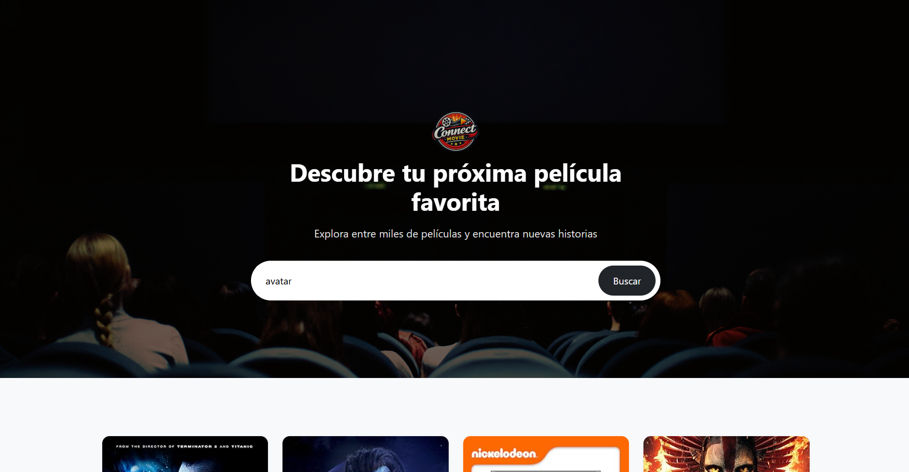
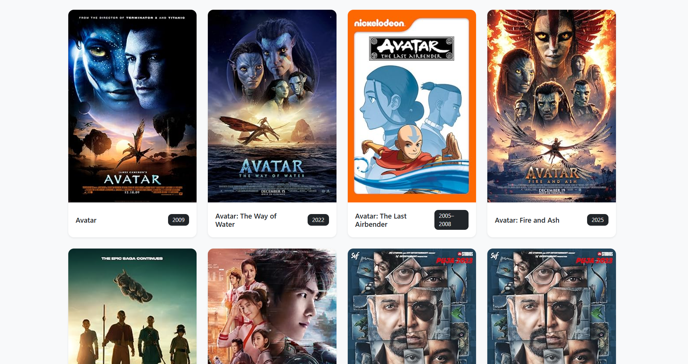
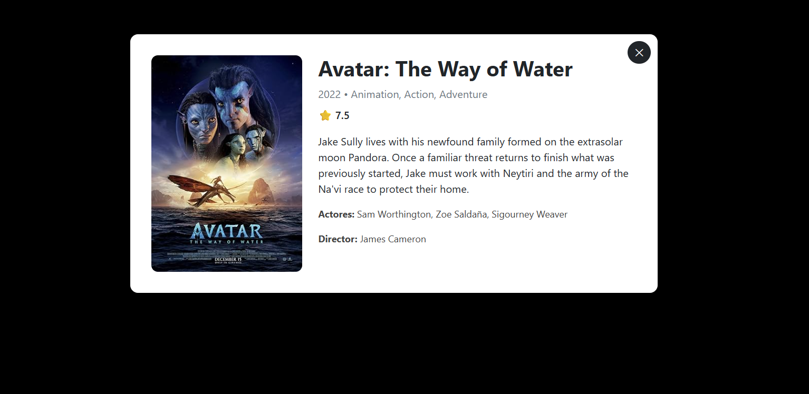

# 🎬 ConnectMovie

Aplicación web de búsqueda de películas desarrollada con Vue 3 y Vite, que consume la API de OMDb para mostrar información en tiempo real.
Proyecto enfocado en consumo de APIs externas y arquitectura basada en componentes en Vue 3.

--------

## 📸 Vista previa

### Hero

  

### Movie Cards

  

### Movie Modal

  

--------

## 🚀 Características

- 🔍 Búsqueda de películas en tiempo real.
- 🎬 Consumo de API externa (OMDb).
- ⚡ Manejo de estados asíncronos (loading, error).
- 🧩 Comunicación entre componentes (Props & Emits).
- 🎨 Diseño responsivo con Bootstrap 5 + metodología BEM.
- 🖼️ Manejo de imágenes faltantes (fallback personalizado).
- 📄 Modal con detalle completo de cada película.

--------

## Componentes principales

- **App.vue**  
  Componente raíz que gestiona el estado global de la aplicación, incluyendo la búsqueda, resultados y control del modal.

- **MovieCard.vue**  
  Componente reutilizable que muestra la información básica de cada película (imagen, título y año).

- **MovieModal.vue**  
  Muestra el detalle completo de la película seleccionada mediante una vista tipo modal.

--------

## 🔄 Comunicación entre componentes

La aplicación implementa comunicación entre componentes utilizando **Props y Emits**, siguiendo el flujo de datos unidireccional de Vue.

- **Props:**  
  Los datos de cada película se envían desde `App.vue` hacia `MovieCard.vue` y `MovieModal.vue`.

- **Emits:**  
  `MovieCard.vue` emite eventos al hacer clic en una película para notificar al componente padre (`App.vue`), el cual gestiona la lógica y abre el modal.

- **Gestión centralizada:**  
  `App.vue` actúa como componente contenedor, manejando:
  - estado de carga (`loading`).
  - resultados de la búsqueda.
  - película seleccionada.
  - control del modal.

Este enfoque permite mantener una arquitectura clara, escalable y fácil de mantener.

--------

## 🛠️ Tecnologías

- Vue 3 (Composition API)
- Vite
- Axios
- Bootstrap 5

--------

## ⚙️ Instalación y uso
1️⃣ Clonar repositorio
git clone https://github.com/JavieraLoy/ConnectMovie.git

2️⃣ Entrar al proyecto
cd movie-search

3️⃣ Instalar dependencias
npm install

4️⃣ Ejecutar en desarrollo
npm run dev

## 🔐 Variables de entorno
- Crea un archivo `.env` en la raíz del poryecto:
VITE_OMDB_API_KEY=tu_api_key_aqui

-Puedes usar el archivo .env.example como referencia.

--------

📌 Contexto del proyecto

Este proyecto fue desarrollado como parte de un ejercicio enfocado en:

• Comunicación entre componentes en Vue.
• Consumo de APIs externas y manejo de estados asíncronos.
• Uso de Props y Emits.
• Manejo de estado reactivo.
• Buenas prácticas de UI/UX.

👩‍💻 Autor

Javiera Loyola